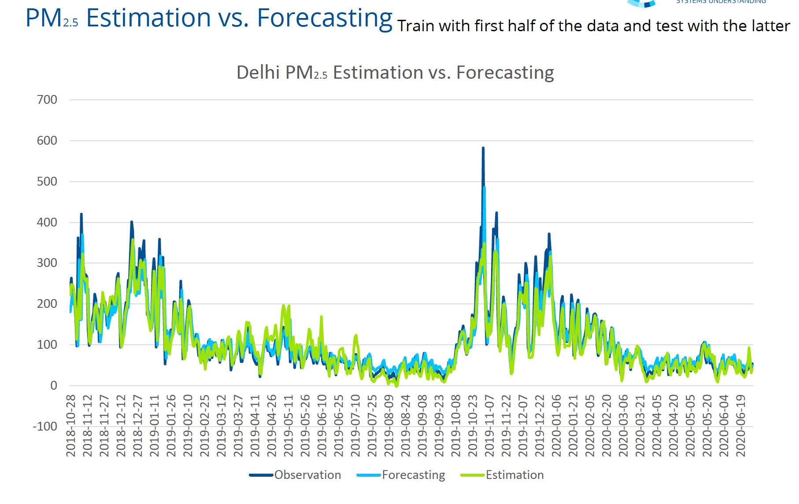
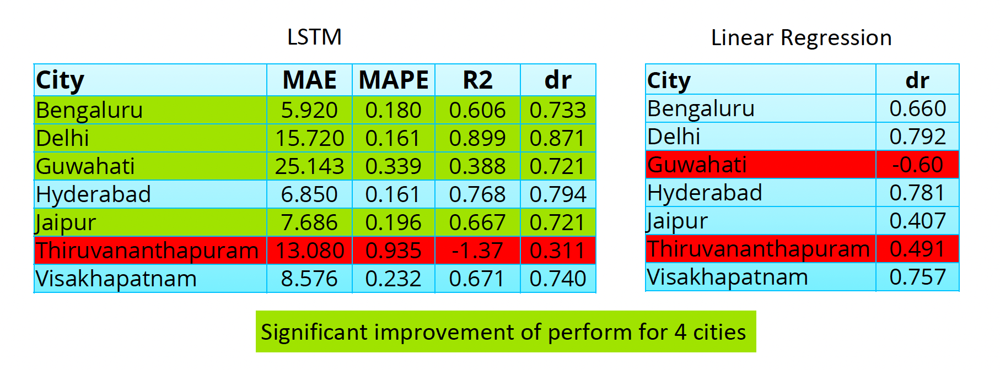
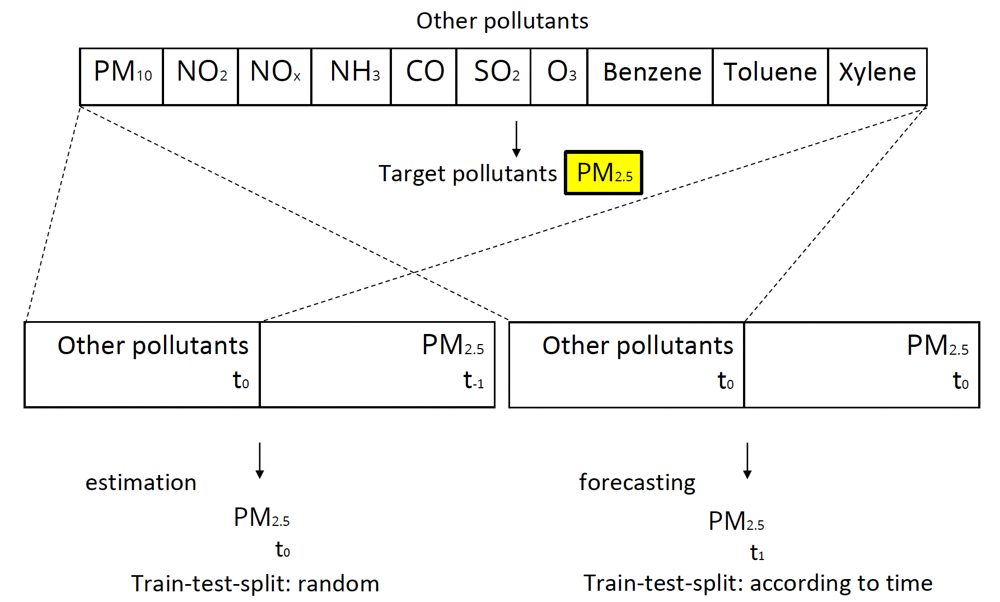

# Air-Quality-Forecast-Project
## Linear Regression and LSTM ML models for air quality prediction.
A summer project for predicting the concentration of PM2.5 pollutants in the atmosphere. This project utilizes Linear Regression and Long Short-Term Memory (LSTM) machine learning models to do an estimate and forecast of the PM2.5 pollutants. This is done by taking in to consideration the relative concentration of PM2.5 in relation to the other common air pollutants(PM10, NO2, NH3, CO, SO2, O3, Benzene, Tolune, Xylene) on a dataset collected over a period of time. The data sets used for training and testing are pulled from kaggle - https://www.kaggle.com/datasets/rohanrao/air-quality-data-in-india  

**Key Conclusions**:
* Both LR and LSTM are capable of predicting PM2.5 with the above dataset.
* Estimation has better performance than forecasting with Linear regression.
* LSTM outperforms LR for forecasting PM2.5 in four cities.

